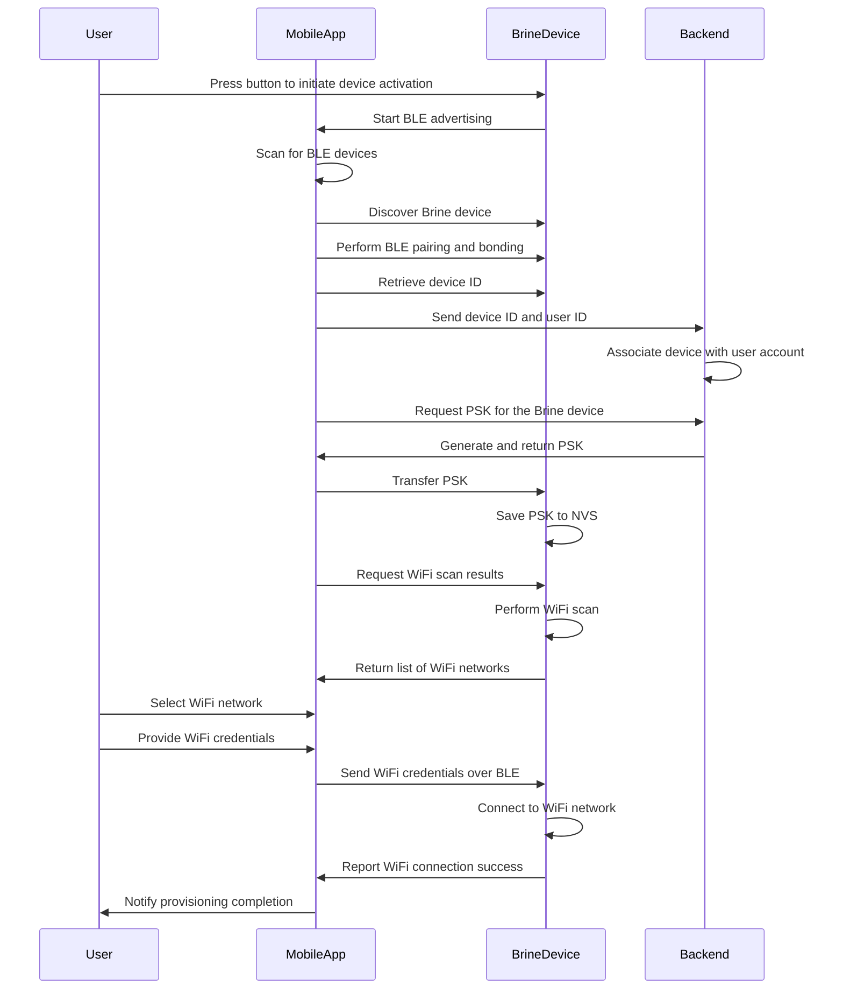

# Brine


The companion app for the Brine Monitor, an IoT device that monitors the amount of salt remaining
in a water softener.

[](https://pub.dev/packages/very_good_analysis)

# Hello :wave:

Do you ever forget to refill the salt in your water softener? Yes you do. It is probably a safe
bet to say that everybody who has a water softener in their home forgets to refill the salt from
time to time. That "time to time" might even be several months in row.

The Brine water softener monitor keeps track of the amount of salt remaining in your water softener
and delivers alerts when the level is low. With this tool, you can keep your water softener filled
with salt and working properly, which, in turn, will keep your appliances free of mineral deposits,
your hands and hair well-moisturized, your laundry machine effective, and spots off your dishes.

# Application Flow

The application has two main workflows. First, the app implements a provisioning process used to
add a Brine device to the user's account. This process consists of communicating with a target
Brine device via Bluetooth Low Energy, connecting that device to a WiFi network, and performing an
API call necessary to associate the Brine device to the user's account.

Second, the app displays information about one or more Brine devices on a user's account on a
"dashboard" screen, which includes the most recently reported salt and battery level for the
device, as well as information about the device itself. The app will facilitate the delivery
of push notifications when the battery and/or salt level on one of the Brine devices for a user
are low.

## Provisioning Flow

The diagram below shows the provisioning flow for a Brine device.

> Some details in this flow are still being implemented and may change over time.



# Bluetooth API Overview

The Bluetooth API enables communication between the Flutter app and the IoT device using a
JSON-based protocol. This section provides an overview of the structure of the API, including the
format for commands and responses

## Command Structure

Commands are sent from the central device (e.g., a Flutter app) to the IoT peripheral device. Each
command is represented as a JSON object with a command field specifying the type of command.

**Example Command**:

To request the device ID from the IoT device, the following JSON command is used:

```json
{
    "command": "get_device_id"
}
```

## Response Structure

Responses are sent from the IoT peripheral device to the central device in reply to commands. Each response is represented as a JSON object with a response field specifying the type of response.

**Success Responses**

For example, a successful response to the get_device_id command will include the device ID:

```json
{
    "response": "device_id",
    "device_id": "Brine-1234"
}
```

**Error Responses**

If an error occurs or an unknown command is received, an error response is sent:

```json
{
    "response": "error",
    "message": "Unknown command"
}
```

# Firebase Local Emulator Notes

Development can be done against the Firebase local emulator rather than the live Firebase
environment in order to prevent interference with the production environment and to provide a
safe environment for development without billing.

Start the Firebase emulator with the command, `firebase emulators:start`.


