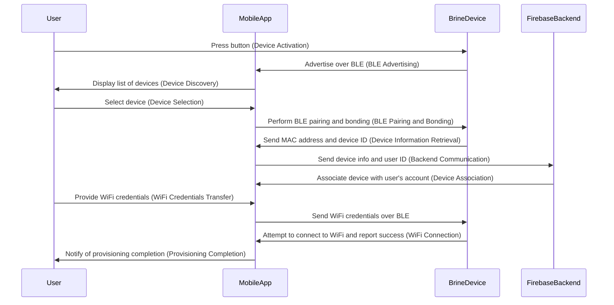

# Provisioning Process for Brine IoT Devices

## Introduction

This document outlines the provisioning process for Brine IoT devices. The process involves interaction between the physical Brine device, a mobile app, and a Firebase backend service.

## Process Overview

1. **Device Activation**: The user initiates the process by pressing a button on the physical Brine device.
2. **BLE Advertising**: The Brine device begins advertising information over Bluetooth Low Energy (BLE).
3. **Device Discovery**: The mobile app scans for Brine devices over BLE and presents a list of available devices to the user.
4. **Device Selection**: The user selects the desired Brine device from the list.
5. **BLE Pairing and Bonding**: The mobile app performs BLE pairing and bonding with the selected Brine device.
6. **Device Information Retrieval**: The mobile app obtains information from the Brine device, including the MAC address and device ID.
7. **Backend Communication**: The mobile app sends the retrieved device information, along with the authenticated user's ID, to a Firebase backend service via a REST API endpoint.
8. **Device Association**: The Firebase backend service associates the Brine device with the user's account.
9. **WiFi Credentials Transfer**: The mobile app collects WiFi credentials from the user and sends them to the Brine device over BLE.
10. **WiFi Connection**: The Brine device attempts to connect to the WiFi network using the provided credentials and reports the success of this operation back to the mobile app over BLE.
11. **Provisioning Completion**: Once the Brine device is successfully connected to the WiFi network, the provisioning process is complete.

## Detailed Steps

### Device Activation

The device activation step is the first step in the provisioning process. It involves the user pressing a button on the physical Brine device to initiate the process. This button press serves as a proof of possession check, ensuring that the user attempting to provision the Brine device has physical access to it.

Once the button is pressed, the Brine device starts advertising information over Bluetooth Low Energy (BLE). This enables the mobile app to discover and connect to the Brine device. The device will continue to advertise and accept incoming connections for a period of three minutes after the button is pressed.

During this time, the mobile app scans for Brine devices over BLE and presents a list of available devices to the user. The user can then select the desired Brine device from the list to proceed with the provisioning process.

### Device Discovery

The device discovery step involves the mobile app scanning for nearby Brine devices over Bluetooth Low Energy (BLE). This is done by performing a BLE scan and filtering the results based on the primary service UUID used by all Brine devices.

### Device Selection

In most cases, only a single Brine device is expected to be discovered over Bluetooth Low Energy (BLE). In this scenario, the mobile app will automatically continue to the next step without user intervention.

However, there may be situations where multiple Brine devices are detected during the scan. In such cases, the mobile app will present a list of available devices to the user. The user can then choose the specific Brine device they wish to provision from the list.

This user selection ensures that the provisioning process is performed on the intended Brine device and avoids any potential confusion or errors that may arise from provisioning the wrong device.

Once the user selects the desired Brine device, the mobile app proceeds to the next step in the provisioning process.

### BLE Pairing and Bonding

The BLE pairing and bonding step is crucial for ensuring a secure provisioning process. During this step, the mobile app establishes a secure connection with the selected Brine device by performing BLE pairing and bonding.

One important aspect of this step is the use of encrypted BLE characteristics for sharing sensitive information, such as WiFi credentials. As mentioned earlier, WiFi credentials are shared between the mobile app and the Brine device during the provisioning process. These credentials contain sensitive information that, if intercepted, could compromise the security of the WiFi network.

By using encrypted BLE characteristics, the risk of interception and compromise of WiFi credentials is minimized. Encrypted characteristics ensure that the messages exchanged between the mobile app and the Brine device are protected and cannot be easily deciphered by unauthorized parties.

To achieve this, both the mobile app and the Brine device must support the necessary encryption algorithms and key exchange protocols. The mobile app initiates the pairing process by sending a pairing request to the Brine device. The Brine device responds with a pairing response, and both devices exchange encryption keys to establish a secure connection.

Once the secure connection is established, the mobile app can safely share the WiFi credentials with the Brine device over the encrypted BLE characteristics. This ensures that even if the messages are intercepted, they cannot be easily decrypted without the encryption keys.

Using encrypted BLE characteristics for sharing WiFi credentials adds an extra layer of security to the provisioning process, protecting sensitive information from unauthorized access. It is important to ensure that both the mobile app and the Brine device are properly configured to support encryption and that the encryption keys are securely exchanged during the pairing and bonding process.

### Device Association

The device association step is where information about the Brine device and the authenticated user is linked in backend resources. This association enables the mobile app to retrieve a list of Brine devices associated with the user and display relevant information from those devices.

To perform the device association, the mobile app sends the retrieved device information, including the MAC address and device ID, along with the authenticated user's ID, to a Firebase backend service via a REST API endpoint.

The Firebase backend service receives the device information and user ID and associates the Brine device with the user's account. This association is typically stored in a database or other backend resources, allowing the mobile app to query and retrieve the associated devices when needed.

By associating the Brine device with the user's account, the mobile app can provide a personalized experience for the user. On future launches of the mobile app, it can retrieve the list of associated Brine devices from the backend and display relevant information from those devices, such as device status, sensor readings, or other device-specific data.

The device association step is crucial for maintaining a seamless connection between the Brine devices and the user's account, enabling efficient management and monitoring of the devices through the mobile app.