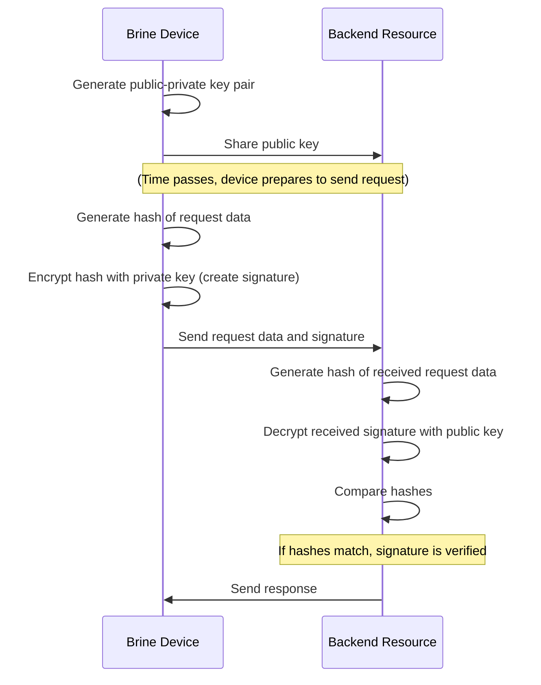

# Cryptographic Coprocessor in Brine Devices

## Introduction

In all aspects of Brine's design, from the mobile app, to the Firebase backend, to the physical Brine hardware and the firmware runnong on it, security is of critical importance. One of the key aspects of IoT security is cryptography, which ensures the confidentiality, integrity, and authenticity of data. Cryptography is especially important in IoT devices, where sensitive data is often transmitted over networks that could be vulnerable to attacks.

A critical component in the implementation of cryptography in Brine devices is the cryptographic coprocessor. This specialized hardware device is designed to handle complex cryptographic operations, offloading these tasks from the main processor and thereby enhancing both security and performance.

Brine devices make extensive use of cryptographic coprocessors. These devices leverage the power of cryptographic coprocessors to handle the generation and storage of public-private key pairs, which are used to sign requests sent to backend resources. This allows backend resources to verify the identity and authenticity of the Brine devices from which they are receiving information, adding an additional layer of security to the communication process.

## Understanding Public-Private Key Pairs

Public-private key pairs are a fundamental concept in cryptography. They consist of two mathematically related keys: a public key, which can be freely distributed, and a private key, which is kept secret. The keys are generated together and are unique; data encrypted with one key can only be decrypted with the other.

In the context of cryptography, these key pairs are used for several purposes, including encryption and decryption of data, and digital signatures. The latter is particularly relevant for Brine devices. When a Brine device needs to send a request to a backend resource, it first signs the request with its private key. This process involves creating a unique piece of data (the signature) that is dependent on both the request data and the private key.

The backend resource, which has the corresponding public key, can then verify the signature. It does this by using the public key to reverse the signing process. If the result matches the original request data, the signature is verified. This not only confirms that the data has not been tampered with during transmission (ensuring data integrity) but also verifies that the data came from the Brine device (ensuring authenticity).

This process of signing and verifying requests is crucial in secure communication. It allows backend resources to confirm the identity of Brine devices and ensure the authenticity of the data they are receiving, providing a robust defense against potential security threats.

## Signing Requests with Generated Key Pairs

Once a public-private key pair has been generated, it can be used to sign requests. The process of signing a request involves creating a unique piece of data, known as a signature, that is dependent on both the request data and the private key.

To sign a request, the device first generates a hash of the request data. This hash is then encrypted using the device's private key, creating the signature. The signature is unique to the specific combination of the request data and the private key, meaning that even a small change in either would result in a completely different signature.

The signed request, consisting of the original request data and the signature, is then sent to the backend resource. The backend resource can use the public key, which it has previously received from the device, to decrypt the signature and compare the resulting hash to a hash it generates from the received request data. If the two hashes match, the signature is verified.

Signing requests with the private key is a crucial step in secure communication. It allows backend resources to verify the identity of the device sending the request, as only the device with the correct private key could have created a valid signature. This ensures the authenticity of the device, providing a robust defense against potential security threats.

