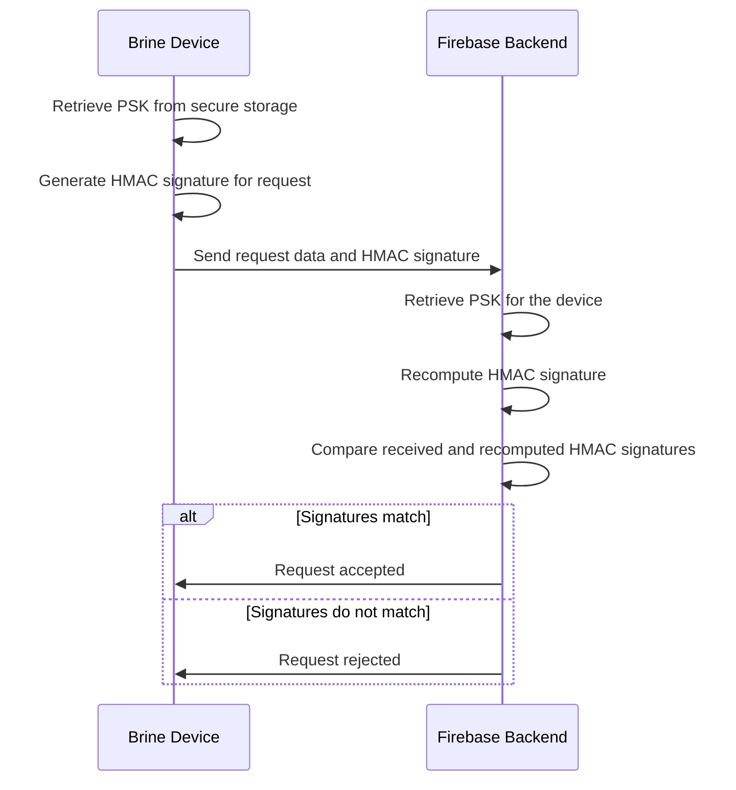

# HMAC-Based Security in Brine Devices

## Introduction

In all aspects of Brine’s design—from the mobile app to the Firebase backend, to the physical Brine hardware and the firmware running on it—security is of critical importance. A key component of IoT security is ensuring the authenticity and integrity of the data transmitted between devices and backend services. This is particularly challenging in IoT environments, where devices operate in potentially hostile networks.

Brine devices implement a robust security mechanism based on HMAC (Hash-based Message Authentication Code) signatures. This mechanism ensures that only authorized devices can send data to the backend by enabling the Firebase backend to verify the authenticity of incoming requests. Unlike more complex cryptographic systems that require public-private key pairs and cryptographic coprocessors, HMAC-based security provides a lightweight, efficient, and highly secure alternative that is well-suited to resource-constrained IoT devices.

## Understanding HMAC Signatures

An **HMAC** is a specific type of message authentication code that involves a cryptographic hash function and a secret key. In the case of Brine devices, the secret key is a pre-shared key (PSK) that is securely provisioned on each device during the initial setup process.

The HMAC algorithm works by combining the request data with the PSK and hashing the result using a cryptographic hash function (typically SHA-256). This produces a unique HMAC signature for the request, which can be verified by any party that also possesses the PSK.

In the Brine infrastructure, the process works as follows:
1.  **Device Side**:
    The Brine device generates an HMAC signature for each request it sends to the Firebase backend by:
     - Creating a hash of the request data.
	 - Combining the hash with the PSK.
	 - Applying the SHA-256 algorithm to produce the HMAC signature.
2.	**Backend Side**:
    When the Firebase backend receives a request, it performs the same HMAC generation process using the PSK associated with the device. If the generated HMAC matches the one provided in the request, the backend verifies that the request is authentic and unmodified.

## How HMAC Signatures Ensure Security

HMAC signatures provide two key security properties:

1.	**Authenticity**:
    Since only devices with the correct PSK can generate a valid HMAC signature, the backend can be confident that the request originates from an authorized device.
2.	**Integrity**:
    If any part of the request data is tampered with during transmission, the resulting HMAC signature will not match, allowing the backend to detect and reject such tampered requests.

This approach ensures that only legitimate devices can interact with the backend, preventing unauthorized data submission and potential security breaches.

## Example Sequence Diagram

The following sequence diagram illustrates the HMAC-based request signing and verification process:

## Provisioning and PSK Management

The security of the HMAC-based system relies on the secure management of PSKs. The Brine infrastructure includes the following mechanisms for provisioning and managing PSKs:

1.	**Initial Provisioning**:
    During the initial setup, the mobile app securely transfers a unique PSK to the Brine device via a secure Bluetooth connection. The device stores the PSK in its non-volatile storage (NVS) for later use.
2.	**PSK Rotation**:
    If a device is compromised or if the PSK needs to be updated for any reason, the PSK can be rotated by re-provisioning the device with a new key.
3.	**PSK Revocation**:
    In the event that a device is lost or compromised, the associated PSK can be revoked in the backend, ensuring that requests from the compromised device are no longer accepted.
