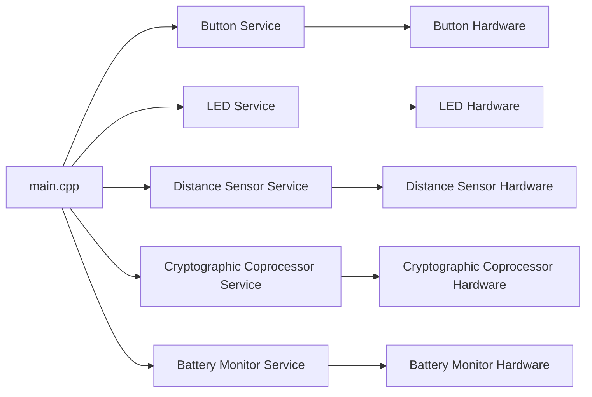

# Brine Device Firmware

This repository contains the firmware for Brine, an IoT device that monitors the amount of salt remaining in a water softener.

# Hello :wave:

Do you ever forget to refill the salt in your water softener? Yes you do. It is probably a safe bet to say that everybody who has a water softener in their home forgets to refill the salt from time to time. That "time to time" might even be several months in row.

The Brine water softener monitor keeps track of the amount of salt remaining in your water softener and delivers alerts when the level is low. With this tool, you can keep your water softener filled with salt and working properly, which, in turn, will keep your appliances free of mineral deposits, your hands and hair well-moisturized, your laundry machine effective, and spots off your dishes.

## Hardware

The Brine device is built around the ESP32, a powerful, versatile microcontroller that provides the WiFi connectivity necessary for the IoT functionality of the device and BLE connectivity necessary for its setup process. The ESP32 was chosen for its combination of processing power, connectivity options, and power efficiency, which is crucial for a battery-powered device.

The primary sensor used by the Brine device is the VL53L1X distance sensor. This sensor measures the distance from the top of the water softener to the level of the salt within the appliance. By comparing this measurement to the known distance when the water softener is empty, the device can calculate an approximate percentage of salt remaining.

For user feedback, the device includes an RGB LED. This LED can display different colors and patterns to indicate the device's status. This system is mainly used during the provisioning process and the LED generally remains off during normal operation so its use does not affect the battery life of the device.

To ensure secure communication with backend services, the device includes a cryptographic coprocessor. This coprocessor handles authentication, ensuring that the data sent and received by the device is secure and trustworthy.

The device is powered by three AA batteries. To maximize battery life, the device spends most of its time in a deep sleep state. It wakes up once every 24 hours to measure the salt level, send the data to the backend services, and then returns to the deep sleep state. This power management strategy allows the device to operate for extended periods without requiring a battery change.

The device is designed to be mounted inside the lid of a water softener, facing down towards the salt. This positioning allows the distance sensor to accurately measure the salt level.

## Firmware

The firmware for the Brine device is written using PlatformIO, an open-source ecosystem for IoT development, in conjunction with Visual Studio Code, a powerful and versatile code editor. The Arduino framework is used due to its simplicity, robustness, and the vast amount of resources and libraries available.

The firmware follows a service-oriented architecture, encapsulating different pieces of functionality into their own modules. This design allows for a high degree of modularity and reusability, making the firmware easier to understand, maintain, and extend.

Each service in the firmware is responsible for a specific piece of functionality. For example, there might be a service for managing the distance sensor, another for handling communication with the backend services, and yet another for controlling the RGB LED.

The firmware also includes power management functionality to ensure the device spends most of its time in a deep sleep state, waking up only to perform measurements and communicate with the backend services. This approach maximizes battery life and ensures the device can operate for extended periods without requiring a battery change.



## Getting Started

To start working with the Brine device firmware, follow these steps:

### Setting Up the Development Environment
1. Install [Visual Studio Code](https://code.visualstudio.com/download).
2. Open Visual Studio Code and navigate to the Extensions view (View -> Extensions).
3. Search for and install the PlatformIO IDE extension.

### Adding Libraries
The Brine device firmware uses several libraries. To add them to your project:
1. Open the PlatformIO home page in Visual Studio Code (View -> PlatformIO).
2. Navigate to Libraries.
3. Search for and install the following libraries: (List the libraries used by the project)

### Connecting the Device
1. Connect the Brine device to your development machine using a USB cable.
2. In Visual Studio Code, open the PlatformIO home page.
3. Navigate to Devices to verify that the Brine device is recognized.

### Flashing Firmware
1. Open the Brine device firmware project in Visual Studio Code.
2. Build the project by clicking the checkmark icon in the PlatformIO toolbar.
3. Upload the firmware to the device by clicking the right arrow icon in the PlatformIO toolbar.

After following these steps, your Brine device should be running the latest firmware and ready for use.

## Commenting and Documentation

Doxygen-style comments are used throughout this project for code documentation. This allows for the automatic generation of documentation and ensures that the codebase is easy to understand and maintain.

The following guidelines regarding documentation should be followed while working on this project:

1.  Always document code as it is written. It is much easier to write comments while the code is fresh in your mind and you still have the context in which it was written.
2. Use Doxygen-style comments (`/** ... */` for multi-line comments, `///` for single-line comments).
3.  Document all public APIs. Include a brief description, detailed description, parameters, and return values.
4.  Use `@brief` for a brief description, `@details` for a detailed description, `@param` for parameters, and `@return` for return values.
5.  For classes and structures, document what they represent and how they should be used.
6.  For functions, document what they do, what the parameters are, what value they return, if any, and the purpose for which they were created.

Here is a generic Doxygen comment template for a function:

```
/**
 * @brief Brief description of the function
 * @details Detailed description of the function
 * 
 * @param paramName Description of the parameter
 * @return Description of the return value
 */
void functionName(Type paramName) {
    // function body
}
```

And for a class:

```
/**
 * @brief Brief description of the class
 * @details Detailed description of the class
 */
class ClassName {
    // class body
}
```